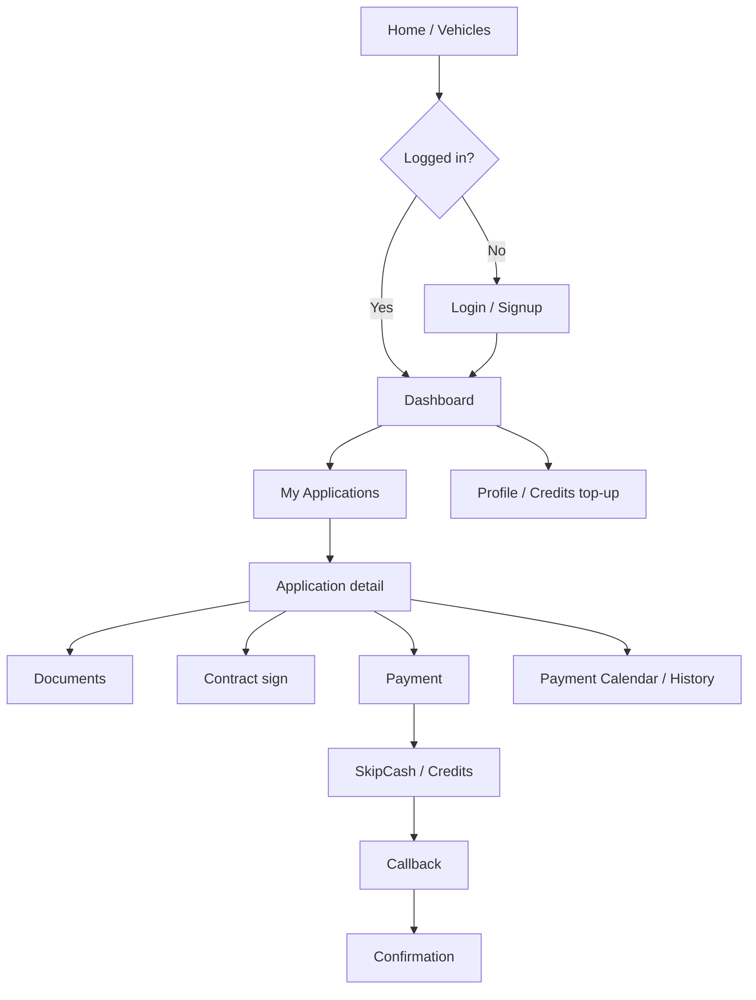

# Blox Customer — User Flows & Experience Design (Mobile Handoff)

This document describes **end-to-end customer journeys** in the Blox web customer app (`packages/customer`) so a **Flutter** (or other mobile) project can replicate flows, screens, and **visual design** consistently. It complements `FLUTTER_CUSTOMER_APP_SPEC.md` (technical integration).

**Per-screen catalog:** `CUSTOMER_SCREENS_CATALOG.md` lists every routed screen with **information shown**, **actions**, and **layout/design** notes.

**Sources:** `AppRoutes.tsx`, `CustomerNav.tsx`, `CustomerLayout.tsx`, `packages/shared/src/config/theme.ts`, `app.config.ts`, key feature pages under `packages/customer/src/modules/customer/features/`.

---

## 1. Design system quick reference (apply on every screen)

| Element | Specification |
|---------|----------------|
| **Font** | IBM Plex Sans (fallback: system UI sans-serif) |
| **Page background** | `#F3F0ED` (Light Grey) — default “paper” feel |
| **Primary text** | `#0E1909` (Blox Black) |
| **Secondary text** | `#787663` (Dark Grey) |
| **Primary CTA / highlights** | `#DAFF01` (Lime) with text `#0E1909` |
| **Primary hover / pressed** | `#B8D900` |
| **Dividers / borders** | `#C9C4B7` (Mid Grey), typically `1px` |
| **Cards / surfaces** | White `#FFFFFF` or Light Grey `#F3F0ED`; corner radius **16px**; subtle shadow (see theme `MuiPaper`) |
| **Buttons** | Radius **10px**, no ALL CAPS, ~15px medium weight, padding ~10×20px |
| **Text fields** | Radius **10px**; focus border **2px** `#DAFF01`; idle border `#C9C4B7` |
| **Section headers** (legal / long-form) | Left bar **4px** `#DAFF01`, background `#F3F0ED`, padding ~8–12px |
| **Currency** | Prefix `QAR `, thousands `,`, **0 decimals** |
| **Status chips** | Use `Config.statusConfig` and `Config.paymentStatuses` in `app.config.ts` for label + colour (e.g. lime for due/active, greys for paid, etc.) |

**Logos**

- Nav / contrast: `BloxLogoNav.png`
- Light backgrounds: `BloxLogo.png`  
  (Paths in web: `public/`; bundle in Flutter `assets/images/`.)

---

## 2. Information architecture (where users can go)

### 2.1 Global navigation (top bar — web)

**Always visible** (with `CustomerNav` / `CustomerNavWrapper`):

| Item | Route | Auth |
|------|-------|------|
| Logo (tap) | `/customer/home` | Any |
| Home | `/customer/home` | Any |
| Browse Vehicles | `/customer/vehicles` | Any |
| Dashboard | `/customer/dashboard` | Signed in |
| My Applications | `/customer/my-applications` | Signed in |
| Payment Calendar | `/customer/payment-calendar` | Signed in |
| Help | `/customer/help/faq` | Any |

**Overflow / account (desktop menu or mobile menu):** profile, **Blox Credits** balance, **Top up** credits, notifications (if enabled), **Logout**.

**Mobile app mapping:** Use a **bottom navigation** or **drawer** that exposes the **same destinations**; keep Help and Profile accessible without hunting.

### 2.2 Route tree (functional)

```
/customer/home                          Landing (public)
/customer/vehicles                      Browse (public)
/customer/vehicles/:id                  Detail (public)
/customer/auth/login|signup|forgot-password|reset-password   (guest)
/customer/dashboard                     (auth)
/customer/my-applications               (auth)
/customer/my-applications/:id           (auth)
/customer/applications/new              (auth)
/customer/applications/:id/payment[/:paymentId]   (auth)
/customer/applications/:id/payment-callback     (auth)  ← deep link
/customer/applications/:id/payment-confirmation   (auth)
/customer/applications/:id/documents/upload       (auth)
/customer/applications/:id/contract/sign          (auth)
/customer/payment-calendar              (auth)
/customer/payment-history               (auth)
/customer/profile[...]                (auth)
/customer/credit-topup-callback         (auth)  ← deep link
/customer/help/faq | contact            (public)
```

Default redirect: `/` → `/customer/home`.

---

## 3. User types & entry points

| Persona | Typical entry | Goal |
|---------|---------------|------|
| **Visitor** | Home, marketing, vehicle browse | Learn, browse inventory |
| **Prospect** | Vehicle detail → Sign up / Login | Start financing journey |
| **Applicant** | Create application, documents, contract | Complete underwriting steps |
| **Borrower** | Dashboard, application detail | Pay installments, view schedule |
| **Credits user** | Nav → Top up | Add Blox Credits (SkipCash) |

---

## 4. Flow A — Browse & discover (unauthenticated)

### Steps

1. User opens **Home** (`/customer/home`) — landing content, CTA to vehicles or auth.
2. User taps **Browse Vehicles** → `/customer/vehicles` — list/filter vehicles.
3. User opens **Vehicle detail** → `/customer/vehicles/:id` — specs, imagery, CTA to **apply** or **login**.

### Design

- Nav: logo + Home + Browse Vehicles; hamburger on small screens repeats links.
- Authenticated-only links are **hidden** until login (web) — mobile: same rule.
- Cards: 16px radius, light shadow; primary buttons lime.

### Mobile notes

- Deep link: `https://<domain>/customer/vehicles/:id` for share sheet parity.

---

## 5. Flow B — Registration

### Steps

1. Route: `/customer/auth/signup` (GuestGuard — if already logged in, redirect away).
2. User submits signup form (email/password per Supabase config).
3. Typical outcome: **verification email** — user must confirm before full access (login error hints reference unverified email on `LoginPage`).
4. Success path: redirect/navigation toward **login** or **home** per implementation.

### Design

- Auth pages use a **split or card layout** (`login-page` / `login-shell` pattern): branded banner copy on one side, form on the other on large screens; stacked on mobile.
- Links: “Already have an account? **Login**”, etc.

### Mobile notes

- After signup, surface **“Check your email”** state clearly (match web toasts/alerts).

---

## 6. Flow C — Login & session

### Steps

1. Route: `/customer/auth/login`.
2. Fields: **email or phone** (validation accepts either — see `LoginPage` yup schema), password, optional **remember me**.
3. On success: toast “Login successful!” — app typically lands user on **dashboard** or **intended route** (`location.state.from` pattern may apply).
4. On failure: specific toasts for **email not verified**, **phone login unavailable**, generic credential error.

### Design

- Same shell as signup; primary button lime; secondary links Dark Grey.
- Optional “Quick login” exists in dev/demo — **do not ship** to production mobile.

### Mobile notes

- Persist session securely (Supabase refresh token).
- Support **password visibility** toggle (standard pattern).

---

## 7. Flow D — Email verification gate (authenticated)

### Steps

1. `AuthGuard` loads → calls **email verification check** (`customerAuthService.checkEmailVerificationStatus()`).
2. If **not verified:** user sees **blocking UI**: warning alert “Email Verification Required” with guidance (resend / check inbox) — cannot proceed to main content until resolved (see `AuthGuard.tsx`).
3. If verified: render `CustomerLayout` + child route.

### Design

- Warning surface: MUI `Alert` **warning** severity; clear typography (h6 + body).

### Mobile notes

- Same gating — block tabs with a full-screen or modal **Verify email** experience.

---

## 8. Flow E — Create financing application

### Entry paths

- From **vehicle detail**: user chooses to apply → `CreateApplicationPage` with vehicle context.
- From **dashboard / applications**: “New application” → `/customer/applications/new`.
- Direct: `/customer/applications/new`.

### Steps (simplified — align with `CreateApplicationPage.tsx`)

1. **Auth check:** if not logged in → redirect `/customer/auth/login` with return path.
2. **Blocking rules:** if user already has a **blocking** draft/active application, navigate to that application instead of creating duplicate.
3. User selects vehicle (from browse) or continues from pre-selected `vehicleId`.
4. Multi-step **customer info**, employment, income, tenure/offer alignment — uses shared validators and Supabase APIs (trace component for exact field order).
5. Submit → creates/updates application record → success navigation often toward **`/customer/my-applications`** or **`/customer/my-applications/:id`**.

### Design

- Stepper or section blocks on Light Grey background; primary CTA lime at bottom sticky on mobile (recommended).
- Inline validation errors: Dark Grey or error red per MUI theme (use theme `error` for field errors).

### Mobile notes

- Long forms: save **draft** behaviour if backend supports it (check `Application` `status: draft`).
- Camera upload for documents may appear in **document flow** rather than here — match web.

---

## 9. Flow F — Application hub (list & detail)

### F.1 Applications list

- Route: `/customer/my-applications`.
- Rows/cards: application title, vehicle, **status chip** (colour from `Config.statusConfig`), updated date.
- Tap row → **Application detail** `/customer/my-applications/:id`.
- Empty state: CTA **Browse vehicles** → `/customer/vehicles`.

### F.2 Application detail

- Route: `/customer/my-applications/:id`.
- Shows: status, vehicle, offer, installment summary, **schedule**, actions:
  - **Upload documents** → `/customer/applications/:id/documents/upload`
  - **Pay** (installment / down payment / settlement — see below) → `/customer/applications/:id/payment` with optional `paymentId` index in path
  - **Contract signing** when required → `/customer/applications/:id/contract/sign`
- Back: to list.

### Design

- Detail page: sections separated by **dividers** `#C9C4B7`; schedule table with header row styling per app (often bold + lime accents on key cells).
- Chips for **payment line status** using `paymentStatuses` colours.

---

## 10. Flow G — Documents upload

### Steps

1. Route: `/customer/applications/:id/documents/upload`.
2. User uploads required doc types (categories defined by product — trace `DocumentUploadPage`).
3. Success: return to application detail or next step in wizard.

### Design

- Drop zone / file list; file type icons; progress indicators.
- Lime primary button **Submit** / **Continue**.

### Mobile notes

- Use native file picker & camera; show upload progress per file.

---

## 11. Flow H — Contract signing

### Steps

1. Route: `/customer/applications/:id/contract/sign`.
2. User reviews contract data, may capture signature / upload PDF depending on implementation (`ContractSigningPage`).
3. Submit → status moves toward **contracts_submitted** / review states per backend.

### Design

- Readable contract typography (body1 14px); avoid cramming — scroll container with padding 16–24px.

---

## 12. Flow I — Payments (core)

Payments are centered on **`PaymentPage`** (`/customer/applications/:id/payment` or `.../payment/:paymentId`).

### I.1 Preconditions

- Load application + schedule; resolve **which installment** (optional `paymentId` / index in route state).
- **`current_user_can_pay_for_application`** RPC: if false, **disable** or hide pay actions (company pay rules).

### I.2 Payment modes (conceptual)

| Mode | How triggered | User sees |
|------|----------------|-----------|
| **Single installment** | Pay next / selected schedule row | Amount, due date, methods |
| **Settlement (early payoff)** | `location.state` flags `isSettlement` / `settleAll` | Remaining balance, possible **discount** copy |
| **Daily payment** | `location.state.isDailyPayment` + amount/date | Daily amount, converted schedule context |

Implementation detail: `PaymentPage` reads `location.state` for these modes (see effects around `isDailyPayment`, `isSettlement`).

### I.3 Payment methods (typical)

- **SkipCash / card** — redirect to hosted payment URL (`skipcash-payment` Edge Function).
- **Blox Credits** — RPC `customer_pay_installment_with_credits` with `applicationId`, `dueDate`, `amount`.
- **Bank transfer / manual** — where enabled, flows may mark schedule via API (trace `PaymentPage` for “bank transfer” branches).

### I.4 SkipCash redirect (installment)

1. Build `SkipCashPaymentRequest` (amount, names, phone, email, unique `transactionId`, `custom1` JSON for application + payment metadata, `returnUrl`).
2. `returnUrl` must hit **`/customer/applications/:id/payment-callback`** with query params preserved by gateway.
3. `window.location.href = paymentUrl` (web) → mobile: **open external browser** or in-app browser, then **app link** back.

### Design

- Payment summary card: amount large (h2/h3), due date, method tiles (radio or list).
- Primary: **Pay with card** (lime); secondary: **Pay with Blox Credits** if balance sufficient (show balance in nav).
- Loading: full-screen or button spinner during RPC/redirect.

---

## 13. Flow J — Payment callback & confirmation

### J.1 Callback

- Route: `/customer/applications/:id/payment-callback`.
- Reads query params (`status`, `statusId`, transaction refs — gateway-specific).
- Calls **`skipcash-verify`** via `skipCashService`; updates UI: success / pending / failed.
- Copy: on slow verification, **pending** state with “retry” and reassurance (see `PaymentCallbackPage` messages).
- Actions: **Back to application**, **Retry verification**, **Print receipt** (if implemented).

### J.2 Confirmation

- Route: `/customer/applications/:id/payment-confirmation`.
- Receives **navigation state**: `transactionId`, `amount`, `method`, settlement flags, etc.
- Success UI: check icon, summary, next steps.

### Design

- Success: green check / lime accent; **failed**: error red with clear next action.
- Use **Paper** card 16px radius, centered max-width ~480px on mobile.

### Mobile notes

- Register **app link** for `payment-callback` path; parse same query params as web.

---

## 14. Flow K — Blox Credits (balance & top-up)

### K.1 Balance

- Shown in **CustomerNav** next to wallet icon — `useCredits()` hook reads `user_credits` by user email.
- Format: currency **QAR** (credits may display as integer units — match web).

### K.2 Top-up initiation (from nav dialog)

1. User enters **credits to buy** (integer); price per credit from product constant (web uses **1 QAR per credit** in `CustomerNav` — confirm `BLOX_CREDIT_PRICE_QAR`).
2. App calls **`skipcash-payment`** with:
   - Unique `transactionId`
   - Amount = credits × price
   - `custom1` includes `{ type: 'credit_topup', credits, ... }` (must match Edge Function)
   - `returnUrl` = `{origin}/customer/credit-topup-callback?transactionId=...&credits=...`
3. Persist **`pending_credit_topup_${transactionId}`** in storage (JSON: credits, transactionId, paymentId, timestamp).
4. Redirect to **SkipCash** URL.

### K.3 Top-up callback

- Route: `/customer/credit-topup-callback`.
- Query: `transactionId`, `credits`.
- Verify via **`skipcash-verify`**; on paid status → call RPC **`customer_claim_payment_credits`** with `p_transaction_id`.
- **Race handling:** if RPC returns “Payment transaction not found”, **poll** `payment_transactions` and retry claim (see `claimCreditsWithRetry` — max **15** attempts, **~1.5s** delay).
- Success: toast, refresh balance, clear pending storage; navigate home or dashboard.

### Design

- Top-up dialog: simple form + lime **Confirm**; legal microcopy if required.
- Callback page: states **loading / success / failed / pending** with icons (`CheckCircle`, `Error`, etc.).

---

## 15. Flow L — Payment calendar & history

| Route | Purpose |
|-------|---------|
| `/customer/payment-calendar` | Calendar view of dues (colours by status) |
| `/customer/payment-history` | Past payments list / receipts |

### Design

- Calendar: cells use **payment status colours** from `app.config` (`paymentStatuses`).
- List: row with date, amount, status chip, optional **download receipt**.

---

## 16. Flow M — Profile & security

| Route | Purpose |
|-------|---------|
| `/customer/profile` | View/edit profile fields allowed to customer |
| `/customer/profile/change-password` | Password change (Supabase update) |

### Design

- Form layout consistent with auth pages; save button lime; success toasts.

---

## 17. Flow N — Help

| Route | Purpose |
|-------|---------|
| `/customer/help/faq` | FAQ content (static or CMS-driven — trace page) |
| `/customer/help/contact` | Contact support (form/email/phone per implementation) |

Accessible **without login** (wrapped in `CustomerNavWrapper`).

### Design

- Readable line length; section titles with optional lime left border for consistency with brand docs.

---

## 18. Flow O — AI chat (optional / advanced)

- **ChatModal** from nav wrapper: WebSocket to **Blox AI**, file uploads, optional voice.
- **MVP mobile:** omit or replace with **Contact** + **FAQ**.
- Full parity: see `ChatModal.tsx` + `bloxAiClient.ts` for protocol.

---

## 19. Edge cases & messaging (match web tone)

| Situation | User-facing behaviour |
|-----------|-------------------------|
| Email not verified | Block with `AuthGuard` message; resend path if available |
| SkipCash failure | Toast with message; map auth/rate-limit/validation errors to friendly strings (see `CustomerNav` top-up errors) |
| Payment verify timeout | Pending state; “check back” copy (`PaymentCallbackPage`) |
| Credits claim delayed | “Check again” / polling; toast that credits may take a moment |
| Cannot pay for company | Hide/disable pay if RPC false |

---

## 20. Diagram — happy path (borrower)



---

## 21. Checklist for mobile parity

- [ ] Same **route capabilities** (or deep-link equivalents) for payment callbacks and credit top-up.
- [ ] **Auth guard** + **email verification** gate identical to web.
- [ ] **RPC** `current_user_can_pay_for_application` before showing pay.
- [ ] **SkipCash** return URLs registered for the app’s domain / universal links.
- [ ] **Credits** top-up pending storage + **claim retry** logic.
- [ ] **Visual tokens** from §1 applied globally.
- [ ] **QAR** formatting and date formats from `Config` / `intl`.

---

## 22. Related documents

- `docs/FLUTTER_CUSTOMER_APP_SPEC.md` — Supabase, RPCs, models, project structure.
- `packages/shared/src/config/theme.ts` — full MUI theme + `brandColors`.
- `packages/customer/src/modules/customer/routes/AppRoutes.tsx` — authoritative route list.

---

*This document is descriptive of the current web customer app; validate against latest `packages/customer` before shipping mobile.*
