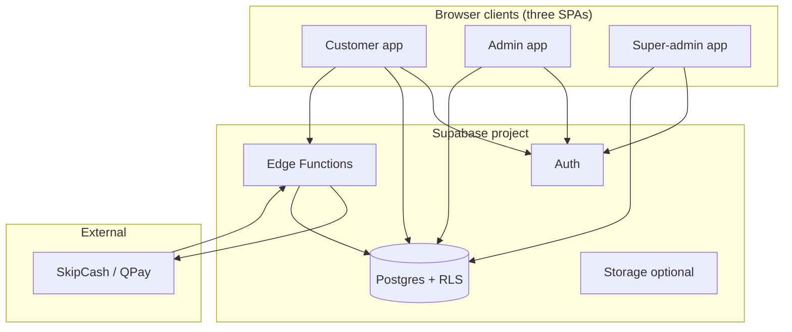
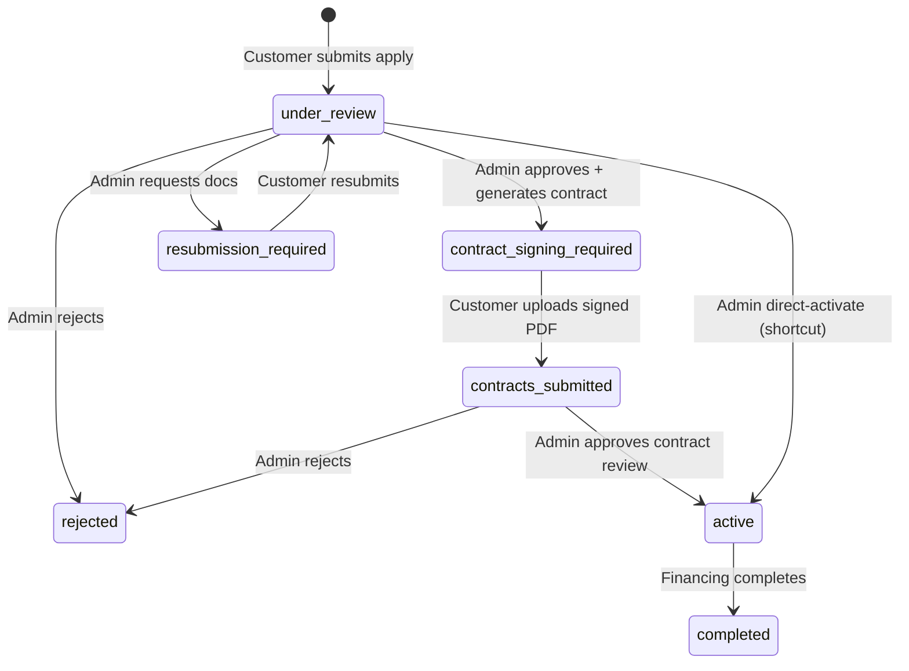

# Blox Platform — Functional & Technical Documentation

This document is the **in-depth platform overview** for Blox as implemented in this repository: **what the product does** (functional view) and **how it is built** (technical view). It complements focused handoff docs:

| Document | Role |
|----------|------|
| [`CUSTOMER_USER_FLOW_AND_DESIGN.md`](CUSTOMER_USER_FLOW_AND_DESIGN.md) | Customer UX, design tokens, navigation |
| [`CUSTOMER_SCREENS_CATALOG.md`](CUSTOMER_SCREENS_CATALOG.md) | Per-screen content (customer web) |
| [`FLUTTER_CUSTOMER_APP_SPEC.md`](FLUTTER_CUSTOMER_APP_SPEC.md) | Mobile parity, integration, security checklist |
| **This file (`PLATFORM_DOCUMENTATION.md`)** | **Part I:** product/roles, customer + admin behaviour, statuses, membership/deferrals. **Part II:** monorepo, stack, services, Supabase, RPCs, build/env/security. |

**Repository root (this monorepo):** `blox-production/` — npm workspaces under `packages/*`.

---

## Architecture at a glance

### System context



**How to read this:** All three apps talk to the **same Supabase project** (per deployed environment) using the **anon key** and the user’s **JWT**. **Edge Functions** hold payment secrets and call **SkipCash**; they and **RPCs** write authoritative payment and credit rows. The browser never holds gateway secrets.

### Source of truth (unambiguous)

| Layer | What is authoritative | What it means |
|-------|------------------------|---------------|
| **Postgres (Supabase)** | Rows in `applications`, `products`, `payment_schedules`, `user_credits`, `payment_transactions`, companies, etc. | **System of record** for financing state, balances, and schedules after writes succeed. |
| **RLS + RPCs + Edge Functions** | Who may read/write which rows; payment and credit **atomic** updates | **Enforcement** — must pass for data to change. |
| **React apps (customer / admin)** | Validation, duplicate-application checks, vehicle list **filtering**, instalment **preview** maths before submit | **UX and product rules** — duplicated in the client for responsiveness; **not** a second database. If the client and DB disagree, **DB wins** once persisted; client rules prevent bad submits and guide users. |

**Examples of client-only logic (must be repeated or moved to RPC if you need server-only guarantees):**

- **Block second application** — Customer app refuses submit when another app for the same email is in a **blocking** status (list in §3.7). This is **not** necessarily enforced by a Postgres `CHECK` in this repo; race conditions are possible without a unique constraint or RPC.
- **Browse: hide “reserved” vehicles** — Filters out vehicles tied to **other** users’ apps in certain statuses (§3.4).
- **Installment schedule preview** — Calculator and create-application flows compute schedules in the browser; admin may regenerate or adjust; persisted schedule lives on the application record in Postgres.

---

# Part I — Functional documentation

## 1. Product overview

**Blox** is a **vehicle financing platform**. It connects:

- **Customers** who browse financed vehicles, submit financing applications, sign contracts, and pay installments (cards, bank transfer, Blox Credits).
- **Operations / dealer staff** who use an **admin** console to manage vehicles (products), financing offers, promotions, applications, users, companies, ledgers, and settings.
- **Platform operators** who use a **super-admin** console for cross-tenant oversight (e.g. activity logs, dashboard).

Currency and locale assumptions in UI are centered on **Qatar (QAR)** and **English** (with hooks for RTL/Arabic in design specs).

---

## 2. Deployable applications (user-facing)

The monorepo ships **three separate Vite SPAs**, each with its own route prefix and purpose:

| App | Package | Base routes (typical) | Primary users |
|-----|---------|------------------------|---------------|
| **Customer** | `packages/customer` | `/customer/...` | End customers |
| **Admin** | `packages/admin` | `/admin/...` | Dealer / operations |
| **Super-admin** | `packages/super-admin` | `/super-admin/...` | Internal platform admins |

Each app uses **React Router**, **MUI**, **Redux Toolkit** (where applicable), and the **`@shared`** library for Supabase access, models, and business services.

### 2.1 Role-based access (functional)

| App | JWT / profile role | Guard behaviour (when `Config.bypassGuards` is false) |
|-----|-------------------|------------------------------------------------------|
| **Customer** | `user.role === 'customer'` | **`AuthGuard`** requires login, **exact role `customer`** (missing/unknown → deny / redirect login with `?reason=not_customer`), and **email verification** (unverified users see a blocking screen until they verify — see §3.5). |
| **Admin** | `user.role === 'admin'` | **Admin `AuthGuard`** redirects non-admins to login with `?reason=not_admin`. |
| **Super-admin** | `user.role === 'super_admin'` | **Super-admin `AuthGuard`** redirects users who are not super-admins to login with `?reason=not_super_admin`. |

Backend **RLS** and RPCs remain the real enforcement layer; guards are for UX and to avoid confusing client-side errors.

---

## 3. Customer application — functional scope

Customer features are grouped under **public** routes (e.g. home, vehicles, help), **auth** routes (login, signup, password), and **authenticated** routes (dashboard, applications, payments, profile) behind login and email verification.

### 3.1 Public (unauthenticated)

- **Landing / home** — Marketing, CTAs to browse or sign up.
- **Vehicle catalog** — Browse, search, filter vehicles (`products` table).
- **Vehicle detail** — Specifications, pricing, installment calculator, promotions.
- **Help** — FAQ (static content), contact support (creates notifications).

### 3.2 Authentication

- Login (email or phone + password), sign-up (identity fields + QID), forgot/reset password via **Supabase Auth**.
- Email verification flows as enforced by Supabase and guarded in UI.

### 3.3 Authenticated customer

- **Dashboard** — Aggregates applications, payments, balances, Blox membership promo, quick actions, recent activity.
- **Applications** — List and detail; status lifecycle; documents; contract download/print/upload; installment schedule; ownership/achievements UI where implemented.
- **New application** — Started from vehicle detail with calculator query parameters; collects personal data, documents, consents; on success creates an application in **`under_review`** in the database.
- **Payments** — Pay installments or settlements; methods include **credit card (SkipCash redirect)**, **debit (QPay)**, **bank transfer**, **Blox Credits** (RPC). Callback and confirmation pages; receipts.
- **Payment calendar / history** — Cross-application view of due and paid items.
- **Profile** — Reads/updates Supabase user metadata (name, phone, address, etc.).
- **Blox Credits** — Balance display, top-up via payment flow, callback to **claim credits** (RPC with retry for webhook timing).
- **Membership** — Purchase paths and deferral-related UI tied to `membershipService` / config (`MembershipConfig`).

### 3.4 Business rules (customer-visible)

- **One active pipeline:** Creating a new application is **blocked** in the customer UI if another application for the same email is in any **blocking** status (exact list in §3.7). This is a **client-side check** before calling the API; see **Source of truth** in the architecture section above.
- **Payments:** UI respects **`current_user_can_pay_for_application`** — if the linked **company** disables payments, the customer sees warnings and cannot pay.
- **Vehicle availability:** For **other customers’** applications only, the catalog **hides** a vehicle when that application’s status is one of: **`active`**, **`under_review`**, **`contract_signing_required`**, **`contracts_submitted`**, **`contract_under_review`**, **`down_payment_required`**. Your own applications do **not** remove vehicles from your list. Statuses like **`rejected`** or **`completed`** are **not** in this set, so those vehicles may still appear for others.

### 3.5 Email verification (customer)

After login, the app checks whether the email is **verified**. If not, the user **cannot** use protected customer areas (dashboard, applications, payments, etc.) until they verify — the screen **Email Verification Required** explains next steps. This is in addition to Supabase session behaviour.

### 3.6 Authentication required to apply

The apply URL **`/customer/applications/new`** is **behind login**. In production builds, **guard bypass is disabled**, so the user must **already be signed in**; otherwise they are sent to the login page. The intended journey is: **Sign up** → verify email if required → browse vehicle → **Apply**.

A **signup-during-submit** branch still exists in code for edge cases; with current routing it **almost never runs**. Development-only **guard bypass** can expose that path for testing.

### 3.7 “Second application” blocking (exact rules)

When submitting (and when pre-checking), the app loads **all** applications for the form email and blocks a **new** submission if **any** existing application is in one of these statuses:

`under_review`, `contract_signing_required`, `resubmission_required`, `contracts_submitted`, `contract_under_review`, `down_payment_required`, `down_payment_submitted`, **`completed`**

**Does not block:** `active`, **`rejected`**, **`submission_cancelled`**, or **`draft`** (draft is not in the blocking list — new apps are typically created as `under_review` directly).

### 3.8 Document uploads on apply (limitation)

On the **new application** form, file handling may **simulate** upload (local preview) while still sending **document metadata** to the API (name, type, category, timestamps). **Durable file storage** (e.g. Supabase Storage URLs) should be assumed only once that integration is complete; until then, operations may need offline follow-up for KYC files.

---

## 4. Admin application — functional scope

Admin screens cover dashboard, applications (list/detail/create), vehicles, offers, promotions, insurance rates, packages, users, companies, ledgers, and settings (settlement discounts, dev utilities).

### 4.1 Core operational areas

| Area | Purpose |
|------|---------|
| **Dashboard** | Operational summary metrics |
| **Applications** | List, create, open detail — review, status changes, contract generation, alignment with customer pipeline |
| **Vehicles / products** | CRUD for inventory (`products`), images, attributes, pricing, status |
| **Offers** | Financing offer definitions (rates, defaults) used when building applications |
| **Promotions** | Time-bound discounts shown on customer vehicle detail |
| **Insurance rates** | Rate cards tied to product packaging |
| **Packages** | Bundling / product packages |
| **Users** | Customer-linked user management (by email, etc.) |
| **Companies** | **Company records**; **`can_pay`** drives whether customers linked to that company can pay |
| **Ledgers** | Financial / ledger views |
| **Settings** | e.g. **settlement discount** settings page |
| **Dev tools** | e.g. clear storage (non-production utility) |

Admin users authenticate via **Supabase Auth** with **role-gated** access: only users with **`role === 'admin'`** may use the admin app (see §2.1). Backend **RLS** still applies.

### 4.2 Admin operational workflow (typical paths)

These behaviours are available from the **application detail** screen in the admin app; which actions appear depends on the application’s **current status** and loaded data.

| Action | Effect (simplified) |
|--------|---------------------|
| **Approve (with contract)** | Opens contract form → on success: sets **`contract_signing_required`**, **`contractGenerated`**, **`contractData`**, refreshes **installment schedule**, logs activity, notifies customer to sign. |
| **Direct approve / activate** | Sets **`active`**, ensures **payment schedule**, notifies customer (shortcut path without contract-signing intermediate state). |
| **Activate draft** | Confirms draft → **`active`** + schedule generation + notification. |
| **Contract review** | **Approve** → **`active`**; **Reject** → **`rejected`** + notification; **Resubmit** → **`contract_signing_required`** and resets signature expectation so customer can re-sign. |
| **Request resubmission (documents)** | **`resubmission_required`** + comments + date; notification points customer to documents flow. |

Admins also manage **vehicles, offers, promotions, users, companies, ledgers**, and **settlement discount** settings elsewhere in the app; those are CRUD screens that read and write through the shared data layer to Supabase.

### 4.3 Walkthrough — Approve with contract (happy path)

This is a **concrete end-to-end story** for operations and PMs; exact button labels may vary slightly by build.

| Step | Who | What happens |
|------|-----|----------------|
| 1 | Customer | Submits financing application → record stored with status **`under_review`**. |
| 2 | Admin | Opens the application in **Admin → Applications**, chooses **approve** and completes the **contract generation** form (terms embedded in the contract payload). |
| 3 | System | Persists **`contract_signing_required`**, sets **`contractGenerated`** and **`contractData`**, refreshes the **installment schedule** as part of the update, logs an activity entry, and creates a **notification** to the customer (“contract ready for signing”) with a link to their application / contract area. |
| 4 | Customer | Opens **My Applications → detail**, downloads the **PDF**, signs offline, uploads the **signed PDF** (and/or uses the dedicated **Contract signing** steps). On successful upload, status becomes **`contracts_submitted`**. |
| 5 | Admin | Sees **`contracts_submitted`**, opens **contract review**, and either **approves** (→ typically **`active`**, financing live), **rejects** (→ **`rejected`**), or asks for **resubmit** (→ back toward signing / **`contract_signing_required`** per review action). |
| 6 | Customer | If activated, can **pay** installments per schedule (subject to **company can pay** and gateway rules). |

**Branches not shown:** direct **activate** without a contract step, **resubmission_required** for documents, **down_payment_** stages, and **reject** earlier in the pipeline — all use the same pattern: **update application row** + **notification**.

---

## 5. Super-admin application — functional scope

- **Dashboard** — High-level platform view.
- **Activity logs** — Audit / activity tracking (`activityTrackingService`).

Narrower than admin by design: focused on **cross-cutting oversight**, not day-to-day vehicle/application ops.

---

## 6. Core domain entities (functional)

These map to TypeScript models under `packages/shared/src/models/` and to **Postgres** tables via Supabase.

| Entity | Meaning |
|--------|---------|
| **Product (vehicle)** | Sellable/financeable vehicle: make, model, trim, year, condition, price, media, attributes, status |
| **Offer** | Financing product parameters (annual rent rates, insurance rates, default flag) |
| **Application** | Customer financing request: links customer, vehicle, offer, company; **status** drives workflow; **installment plan** and **payment schedule**; documents; contract fields |
| **Company** | Business entity; **`can_pay`** gates customer payments when application is tied to company |
| **Promotion** | Marketing discount surfaced on customer UI |
| **Package / insurance rate** | Supporting product configuration for offers and pricing |
| **Ledger** | Accounting-oriented records for operations |
| **User credits** | **Blox Credits** balance and **credit transactions** (top-up, payment debits, admin adjustments via RPC) |
| **Payment transaction** | Card/online payments (SkipCash flow, webhooks, reconciliation) |
| **Notifications** | In-app / stored notifications (e.g. application submitted, support contact) |

---

## 7. Payment & credits (functional)

1. **SkipCash (card)** — Customer initiates payment in app → **Edge Function** creates server-side payment → redirect → **verify** on return → **webhook** completes DB rows. Client **never** holds SkipCash secrets.
2. **QPay (debit)** — Separate redirect path; messaging in UI distinguishes debit vs credit.
3. **Bank transfer** — Customer enters reference/bank metadata in UI; operational confirmation is outside pure automation unless extended.
4. **Blox Credits** — Balance stored per user email; **pay installment** via RPC `customer_pay_installment_with_credits`; **top-up** completes through payment pipeline then **claim** via `customer_claim_payment_credits` (idempotent).
5. **Receipts** — Generated/downloaded via **`receiptService`** after successful payment context.

---

## 8. AI / assisted flows (functional)

The shared **`bloxAIClient`** supports websocket-style interaction and structured **AI application** payloads (`AssessmentResponse`, `AIApplicationInput`, etc.). Usage is feature-dependent; treat as **optional** channel for assisted intake or assessment, not the sole source of truth for contracts (PDF/contracts remain **`ContractPdfService`**).

---

## 9. Application statuses (functional model)

Statuses are the **`ApplicationStatus`** string union in shared domain types. Labels and colours in the UI come from global **status config** (theme / app config) where applicable.

| Status | Typical meaning |
|--------|-----------------|
| **`draft`** | Application started but not fully submitted or not yet activated (admin can activate). |
| **`under_review`** | Default after customer submits apply flow — ops review before contract. |
| **`rejected`** | Application declined (admin review). |
| **`contract_signing_required`** | Contract PDF generated; customer must sign and upload. |
| **`resubmission_required`** | Customer must fix documents or similar (admin comment). |
| **`contracts_submitted`** | Signed contract uploaded; awaiting admin. |
| **`contract_under_review`** | Admin reviewing signed contract (when used in pipeline). |
| **`down_payment_required`** / **`down_payment_submitted`** | Down payment steps in pipeline (when used). |
| **`active`** | Financing live; installment schedule in effect. |
| **`completed`** | Financing / application completed. |
| **`submission_cancelled`** | Cancelled (e.g. by customer); **does not** block opening a new application in customer UI. |

### State machine definition (declared model vs enforcement)

- **Declared model:** The status field on each **`applications`** row is one of the values above. **Valid next states** are not defined as a single database constraint in this repository; instead, **admin and customer UIs** call **update application** with a new status after business checks.
- **Authoritative state:** After any update **commits in Postgres**, that status is the **source of truth** for dashboards, notifications, and payment eligibility.
- **Risk:** The **same** transition could theoretically be triggered twice or out of order if two sessions race — production hardening would add **RPCs with explicit transition rules** or **constraints** if required by compliance.

**Primary happy-path diagram (simplified):**



**Not drawn:** `draft`, `contract_under_review`, `down_payment_*`, `submission_cancelled`, payment-webhook–driven updates, and **shortcut** paths (e.g. activate draft). Treat the diagram as a **communication aid**, not exhaustive formal verification.

**Transitions** are performed by **admin actions** (§4.2–4.3), **customer actions** (upload contract, pay), or **automated** payment pipeline updates. Client-side checks (e.g. “block second application”) are **additive UX**, not a substitute for DB state.

---

## 10. Membership, deferrals, and Blox Credits (functional detail)

Complements §7 (payment rails).

### Blox Membership (product)

- **Reference pricing** shown in product config: **50 QAR / month** only for new purchases (legacy **500 QAR / year** may exist on historical records; not offered in UI).
- **Persistence:** Membership is stored as **`bloxMembership`** JSON on an **application** record when the customer purchases; “do I have membership?” in the UI is derived from the **most recently updated** application that still carries that payload for the logged-in email.
- **Deferrals (marketing):** Copy often mentions **up to three deferrals per year** — the UI may show remaining deferrals; **full enforcement** depends on deferral rows in the database and payment schedule updates, not on marketing text alone.

### Payment deferrals

- **Intent:** Let eligible customers move a due date (or split amounts) within product rules; schedule rows are **updated in Postgres** when deferral completes successfully.
- **Current behaviour:** Yearly deferral **counts** may rely on incomplete historical loading until all deferrals are read from the database everywhere; some **synchronous** UI helpers **optimistically** allow deferral. Treat operational policy as **subject to DB-backed rules** once fully wired.

### Blox Credits (balance)

- Stored per **`user_email`** in **`user_credits`**; **top-up** via SkipCash then **`customer_claim_payment_credits`**; **pay installment** via **`customer_pay_installment_with_credits`** (see §7 and Part II RPCs).

---

# Part II — Technical documentation

## 11. Monorepo layout

```
blox-production/
├── package.json                 # Workspaces, shared devDependencies, scripts
├── packages/
│   ├── shared/                  # @shared: models, services, config, utils, components used by all apps
│   ├── customer/                # Customer Vite app
│   ├── admin/                   # Admin Vite app
│   └── super-admin/             # Super-admin Vite app
├── supabase/
│   ├── functions/               # Edge Functions (Deno) — SkipCash payment, verify, webhook
│   └── migrations/              # SQL migrations (RPCs, schema fixes, payment/credits)
└── docs/                        # Markdown documentation (this file, specs, catalogs)
```

**Workspaces:** `"workspaces": ["packages/*"]` — install once at root; each package may declare its own `name` and scripts.

---

## 12. Technology stack

| Layer | Technology |
|-------|------------|
| UI | React **19**, React Router **7**, MUI **7**, Emotion, SCSS modules |
| Forms / validation | react-hook-form, **Yup** |
| State | **Redux Toolkit** (customer and other apps as wired) |
| Data | **Supabase JS v2** — Auth, Postgres (PostgREST), Realtime optional, **Edge Functions** |
| Payments | **SkipCash** via Edge Functions + verify + webhook |
| HTTP (misc) | Axios (where `apiService` is used) |
| Charts | Chart.js + react-chartjs-2 |
| PDF | react-pdf, print-js; custom **ContractPdfService** / **ReceiptService** |
| Observability | **Sentry** (`@sentry/react`, Vite plugin) |
| Testing | **Vitest** (root), workspace tests under packages |
| Build | **Vite 7**, TypeScript **5.9** |

---

## 13. Shared package (`packages/shared`)

### 13.1 Role

Single **domain layer** for all apps: **Supabase singleton**, **row mapping**, **API façade**, **PDF/receipt generation**, **payment**, **credits**, **permissions**, **AI client**, **caching**, **logging**, **analytics**, **report export**, **activity tracking**.

### 13.2 Supabase client (`supabase.service.ts`)

- **`createClient`** from env: `VITE_SUPABASE_URL`, `VITE_SUPABASE_ANON_KEY`.
- **`mapSupabaseRow`:** recursively converts **snake_case** JSON keys from PostgREST to **camelCase** for TypeScript models (nested objects and arrays included).
- **`handleSupabaseResponse`:** throws on PostgREST error.

**Important:** Raw REST/Flutter clients must either replicate this mapping or use **snake_case** field names consistently.

### 13.3 Primary services (see `services/index.ts`)

| Service | Responsibility |
|---------|----------------|
| **`supabaseApiService`** | Large CRUD façade: products, applications, offers, promotions, users, companies, notifications, packages, ledgers, etc. |
| **`authService`** | Auth helpers layered on Supabase Auth |
| **`skipCashService`** | `functions.invoke` for payment initiation and verification; typed request/response |
| **`paymentPermissionsService`** | RPC `current_user_can_pay_for_application` |
| **`creditsService`** | Read balance; admin RPCs for add/subtract/set; customer-facing credit operations |
| **`ContractPdfService` / `contractPdfService`** | Contract PDF generation from application + form data |
| **`receiptService`** | Payment receipt PDF |
| **`supabaseCache`** | Short-lived in-memory cache (e.g. product list TTL) |
| **`optimizedSupabaseService`** | Optimized/query patterns (see file) |
| **`activityTrackingService`** | Activity log types for super-admin |
| **`reportExportService`** | Export helpers |
| **`analyticsService`** | Analytics hooks |
| **`bloxAIClient`** | AI gateway client |
| **`apiService`** | Legacy/generic HTTP to `Config.base_url` where applicable |

### 13.4 Configuration (`config/app.config.ts`)

- **`Config`:** environment flags, date formats, **statusConfig** / **paymentStatuses** (colours and labels), tenure lists, `translate_text` for calculator codes.
- **`CurrencyConfig`:** QAR formatting (prefix, thousands, 0 decimals).
- **`MembershipConfig`:** reference membership prices (confirm in production).

### 13.5 Theme (`config/theme.ts`)

MUI theme + **brandColors** — referenced by Flutter spec §12 for parity.

---

## 14. Customer package (`packages/customer`)

- **Entry:** `src/main.tsx` / `App.tsx` — providers (Redux, Toastify, MUI theme, etc.).
- **Routes:** `modules/customer/routes/AppRoutes.tsx` — lazy-loaded pages, **AuthGuard** / **GuestGuard**.
- **Layouts:** `CustomerLayout` (authenticated shell), `CustomerNavWrapper` (public with nav).
- **State:** `store/` — slices (e.g. `auth`, `application`).
- **Features:** `features/<area>/` — pages, components, SCSS per feature.
- **Services:** thin wrappers e.g. `customerAuth.service`, `membership.service`, `vehicle.service` calling `@shared`.

---

## 15. Admin package (`packages/admin`)

- **Routes:** `modules/admin/routes/AppRoutes.tsx` — full CRUD routes for applications, vehicles, offers, promotions, insurance, packages, users, companies, ledgers, settings.
- **Guards:** `AuthGuard` / `GuestGuard` for admin login.
- **Layout:** `MainLayout` — sidebar + content.

---

## 16. Super-admin package (`packages/super-admin`)

- **Routes:** dashboard + activity logs; smaller surface area.
- Same stack pattern as admin.

---

## 17. Backend: Supabase

### 17.1 Components used

| Component | Usage |
|-----------|--------|
| **Auth** | Email/password, recovery, session JWT for PostgREST and RPC |
| **Postgres** | System of record for applications, products, payments, credits, companies, etc. |
| **Edge Functions** | SkipCash **payment**, **verify**, **webhook** — server-side secrets |
| **Storage** | Optional file storage (documents may be URLs/base64 depending on feature path) |

### 17.2 Row-level security (RLS)

The codebase assumes **RLS** on sensitive tables: customers see **their** applications; admins use elevated roles or policies. **Exact policies** live in the Supabase project and migrations — **do not** bypass with service role in client apps.

### 17.3 Migrations in repo

Located under `supabase/migrations/`. Examples present in this repo:

| Migration | Intent (high level) |
|-----------|---------------------|
| `20250215000000_customer_pay_with_credits_and_payment_improvements.sql` | `customer_pay_installment_with_credits` RPC; payment schedule amount columns; integration with `user_credits` |
| `20250215100000_credit_topup_claim_idempotency.sql` | Idempotent credit claim after top-up |
| `20250215200000_disable_company_payments.sql` | Company-level payment disable / `can_pay` behaviour |

**Full schema** is the union of all migrations in the connected Supabase project — introspect there for authoritative DDL.

---

## 18. Edge Functions (Deno)

| Function | Role |
|----------|------|
| **`skipcash-payment`** | Create payment intent / redirect payload; attach metadata (`custom1`, etc.) for routing (installment vs credit top-up) |
| **`skipcash-verify`** | Verify transaction status server-side when customer returns |
| **`skipcash-webhook`** | Asynchronous completion: update `payment_transactions`, trigger downstream |

Clients call these via **`supabase.functions.invoke`** with the user’s JWT where applicable, or anon key per function design — **see each `index.ts`** for exact contracts.

---

## 19. Key RPCs (representative)

| RPC | Purpose |
|-----|---------|
| **`current_user_can_pay_for_application`** | Returns boolean — company `can_pay` + ownership checks |
| **`customer_pay_installment_with_credits`** | Atomic debit credits + update schedule |
| **`customer_claim_payment_credits`** | Claim credits after successful top-up payment (idempotent) |
| **Admin credit RPCs** | `admin_add_user_credits`, `admin_subtract_user_credits`, `admin_set_user_credits`, etc. — **admin-only** |

Signatures and return tables are defined in SQL migrations.

---

## 20. Payment flow (technical sequence)

1. **Client** loads application + schedule; checks **can pay** via RPC.
2. **Client** chooses method; for card, **`skipCashService`** invokes **`skipcash-payment`** with amount, customer identity, **return URL**, **transaction id**, **`custom1`** JSON for application/due-date/settlement routing.
3. User completes payment at gateway.
4. **Return path:** **`PaymentCallbackPage`** calls **`skipcash-verify`** and may poll **`payment_transactions`** until webhook writes **completed**.
5. **Webhook** finalizes status and updates installment/application state as implemented.
6. **Receipt** optional via **`receiptService`**.

Credit **top-up** uses a parallel path with **`customer_claim_payment_credits`** and retry if webhook lags.

---

## 21. Data models (technical)

Type definitions live in the **shared** package; key exports include:

- `application.model.ts` — `Application`, `InstallmentPlan`, `PaymentSchedule`, statuses, `CustomerInformation`, etc.
- `product.model.ts` — `Product`, filters
- `offer.model.ts`, `promotion.model.ts`, `package.model.ts`, `insurance-rate.model.ts`
- `company.model.ts`
- `user.model.ts`
- `payment.model.ts`, `ledger.model.ts`
- `dashboard.model.ts`, `settlement-discount.model.ts`
- `api.model.ts` — generic `ApiResponse`

---

## 22. Testing

- **Vitest** at repo root (`npm run test`, `test:run`, `test:coverage`).
- Packages include `__tests__` (e.g. shared services, customer components).
- **jest-axe** / **@axe-core/react** available for accessibility testing in dev.

---

## 23. Build & scripts

| Script | Effect |
|--------|--------|
| `npm run dev:customer` | Customer app dev server |
| `npm run dev:admin` | Admin app (default `npm run dev`) |
| `npm run dev:super-admin` | Super-admin dev server |
| `npm run build` | Build all workspaces |
| `npm run build:customer` / `:admin` / `:super-admin` | Per-package production build |
| `npm run lint` | Lint all workspaces |

Each package’s `vite.config` sets **port**, **aliases** (e.g. `@shared` → `packages/shared/src`), and env handling.

---

## 24. Environment variables (technical)

**Required for Supabase (all apps using `@shared`):**

- `VITE_SUPABASE_URL`
- `VITE_SUPABASE_ANON_KEY`

**Optional / feature-specific:**

- `VITE_API_BASE_URL`, `VITE_FILE_BASE_URL` — `Config` defaults for legacy HTTP file/API usage
- `VITE_BYPASS_GUARDS` — **development only**; forced **off** in production builds (`Config.bypassGuards`)

**Edge Functions** use Supabase-provided secrets in the dashboard (SkipCash keys, webhook secrets) — **not** in the React bundle.

---

## 25. Deployment, environments, and CI/CD

### Environment separation

| Environment | Purpose | Supabase & frontend config |
|-------------|---------|----------------------------|
| **Local / dev** | Developer machines | `.env` / `.env.development` with **dev** project URL and anon key; optional `VITE_BYPASS_GUARDS` for testing. |
| **Staging** | Pre-production verification | **Separate** `VITE_SUPABASE_URL` and `VITE_SUPABASE_ANON_KEY` from production — typically a **dedicated Supabase project** (or isolated branch) so data and RLS can be tested safely. |
| **Production** | Live customers | **Production** Supabase URL and anon key; guard bypass **disabled** in builds. |

**Rule:** Staging and production must **not** share the same Supabase project unless you intentionally accept shared data — the repo’s deployment workflow injects **different** secrets per environment.

### CI/CD (as in `.github/workflows/`)

| Workflow | Role |
|----------|------|
| **`ci.yml`** | On push/PR to **`main`** and **`develop`**: **lint**, **TypeScript check** (admin, customer, shared), **unit tests** (Vitest). |
| **`deploy.yml`** | **Staging:** triggers on **`develop`** or manual **workflow_dispatch** staging — builds admin + customer with **`STAGING_VITE_SUPABASE_*`** secrets, deploys to **Vercel** (non-prod), **smoke** URLs `staging-admin.blox.com` / `staging-customer.blox.com`. **Production:** on **`main`** (push or manual production) — runs **`npm run test:run`**, builds with **`PRODUCTION_VITE_SUPABASE_*`**, deploys **Vercel** with `--prod`, smoke **`admin.blox.com`** / **`customer.blox.com`**, optional rollback on failure. Slack notifications on success/failure. |
| **`health-check.yml`** | Health monitoring (see workflow file). |

**Hosting:** Customer and admin SPAs are deployed as **separate Vercel projects**; super-admin may follow the same pattern if wired in CI (confirm in your org).

**Edge Functions & DB migrations:** Use **`.github/workflows/release-gate.yml`** + **`docs/OPS_CUTOVER.md`**. Production frontend deploy requires secret `BACKEND_GATE_CONFIRMED=true` after migrations and `skipcash-*` functions are live. Smoke checks assert `/health` body contains `ok` (static file, not SPA rewrite).

---

## 26. Security architecture (summary)

| Topic | Practice |
|-------|----------|
| **Client keys** | Only **anon** Supabase key in browser/mobile |
| **Secrets** | SkipCash and webhooks only on **Edge Functions** |
| **Authorization** | RLS + RPC checks + app guards |
| **Payments** | No card numbers in Blox frontend storage; hosted/gateway fields |
| **Session** | Supabase Auth refresh tokens — persist securely on mobile (`secure_storage`) |

---

## 27. Observability

- **Sentry** integrated for React apps (bundled via Vite plugin in the workspace).
- **`loggingService`** / **`devLogger`** in shared code for structured dev logs.

---

## 28. Related documentation index

| File | Content |
|------|---------|
| [`CUSTOMER_USER_FLOW_AND_DESIGN.md`](CUSTOMER_USER_FLOW_AND_DESIGN.md) | Customer journeys, design system |
| [`CUSTOMER_SCREENS_CATALOG.md`](CUSTOMER_SCREENS_CATALOG.md) | Customer screen inventory |
| [`FLUTTER_CUSTOMER_APP_SPEC.md`](FLUTTER_CUSTOMER_APP_SPEC.md) | Mobile implementation spec |
| [`CUSTOMER_JOURNEY_AUDIT_SELECT_TO_APPLICATION.md`](CUSTOMER_JOURNEY_AUDIT_SELECT_TO_APPLICATION.md) | Audit: vehicle → account → application (gaps, fixes, QA checklist) |
| `FIX_DNS_ERROR.md` / `README` variants (if present) | Local env troubleshooting |

---

## 29. Maintenance

- When **navigation or URLs** change, update the **route tables** in this doc and in **`CUSTOMER_SCREENS_CATALOG.md`**.
- When **RPCs or Edge Functions** change, update **migrations**, **functions**, and the **technical** sections here.
- When **product scope** changes, update **Part I** and release notes.

---

*This document describes the Blox codebase in `blox-production`. **CI/CD** and **Vercel** deployment are defined in **`.github/workflows/`**; **secrets** (Supabase keys, Vercel tokens) live in the GitHub / hosting provider — not in the repo.*
